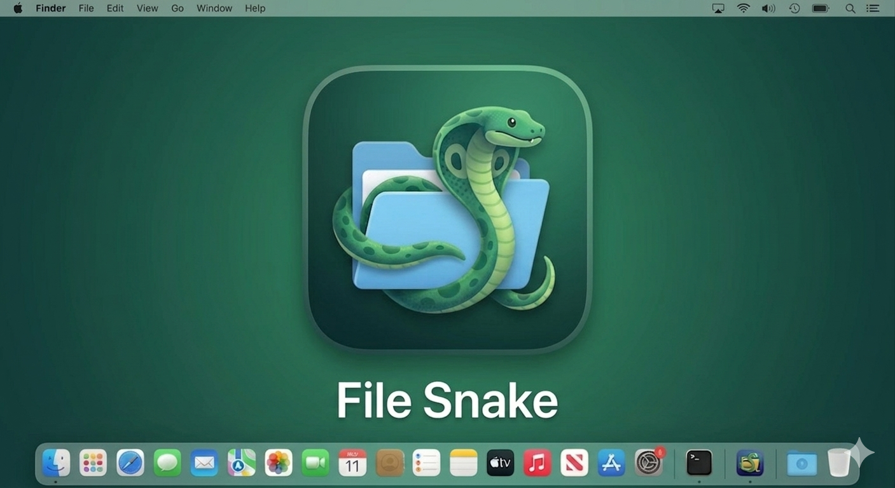

<p align="center">
  
</p>

<h1 align="center">Filesnake</h1>

<p align="center">
  <b>The modern, native macOS archive manager.</b><br>
  Browse, preview, and extract — without the bloat.
</p>

<p align="center">
  <a href="https://github.com/Djozman/Filesnake/releases/latest"></a>
  
  
  
</p>

---

## Why Filesnake?

Most archive tools on macOS either **extract blindly** (The Unarchiver) or **cost money** and feel outdated (BetterZip at $24.95). Filesnake gives you the best of both worlds — a **free**, beautifully native archive manager that lets you **see what's inside before extracting**.

### Filesnake vs. the competition

| Feature | **Filesnake** | **BetterZip** | **The Unarchiver** |
|---------|:---:|:---:|:---:|
| **Price** | 🟢 Free | 🔴 $24.95 | 🟢 Free |
| **Browse before extracting** | ✅ | ✅ | ❌ |
| **Quick Look preview** | ✅ Images, text, PDFs, audio, video | ✅ | ❌ |
| **Selective extraction** | ✅ Pick individual files | ✅ | ❌ |
| **Extract Here (in-place)** | ✅ Right-click → Extract Here | ⚠️ Via presets | ❌ |
| **Batch extract** | ✅ Check & extract multiple | ✅ | ✅ All-or-nothing |
| **Delete from archive** | ✅ ZIP | ✅ | ❌ |
| **Native macOS UI** | ✅ SwiftUI + AppKit | ⚠️ Dated AppKit | ❌ Invisible |
| **Single-instance app** | ✅ Reuses window | ❌ Multiple windows | N/A |
| **Folder navigation** | ✅ Breadcrumb + drill-in | ✅ | ❌ |
| **Drag & drop** | ✅ | ✅ | ✅ |
| **Search / filter** | ✅ Real-time | ✅ | ❌ |
| **Sort by column** | ✅ Name, size, compressed, date | ✅ | ❌ |
| **Open With integration** | ✅ Finder "Open With" | ✅ | ✅ |
| **Three-pane layout** | ✅ Sidebar + list + preview | ✅ | ❌ |
| **Resizable panels** | ✅ Smooth dividers | ✅ | N/A |
| **Open source** | ✅ MIT | ❌ Proprietary | ❌ Proprietary |
| **Lightweight** | ✅ ~5 MB | ❌ ~30 MB | ✅ ~15 MB |

---

## Features

- **Browse before extracting** — see every file inside an archive in a native table view with file icons, sizes, compressed sizes, and dates
- **Quick Look preview** — select any file and instantly preview it: images, PDFs, text, code, audio, video, and anything else Quick Look supports
- **Selective extraction** — right-click to extract individual files or check multiple files and extract them all at once into a single folder
- **Extract Here** — extract selected files directly next to the archive, no dialog needed
- **Delete from ZIP** — remove entries from ZIP archives in-place (rewrites the archive)
- **Folder navigation** — double-click folders to drill in, with a breadcrumb bar to jump back
- **Full-text search** — filter entries by name or path as you type
- **Sort by any column** — click column headers to sort by name, size, compressed size, or modified date
- **Drag & drop** — drop any supported archive onto the window to open it
- **Single-instance** — double-clicking a file while Filesnake is open reuses the existing window
- **Finder-style selection** — blue accent-color highlights with clean white separators
- **Responsive preview** — file info footer adapts to panel width
- **Three-pane layout** — sidebar, file list, and preview pane with smooth resizable dividers
- **Native macOS** — built with SwiftUI + AppKit, feels right at home on macOS 13+

## Format Support

| Format    | Browse | Extract | Delete | Preview |
|-----------|:------:|:-------:|:------:|:-------:|
| `.zip`    | ✅     | ✅      | ✅     | ✅      |
| `.tar`    | ✅     | ✅      | —      | ✅      |
| `.tar.gz` | ✅     | ✅      | —      | ✅      |
| `.gz`     | ✅     | ✅      | —      | ✅      |
| `.rar`    | ✅     | ✅      | —      | ✅      |

> **Note:** RAR support requires [`unar`](https://formulae.brew.sh/formula/unar) — install with `brew install unar`.

---

## Install

### Download (recommended)

1. Grab `Filesnake.zip` from the [latest release](https://github.com/Djozman/Filesnake/releases/latest)
2. Unzip and move `Filesnake.app` to `/Applications`
3. Done — open any archive from Finder or drag it onto the app

### Build from source

```bash
git clone https://github.com/Djozman/Filesnake.git
cd Filesnake
make install    # builds release + installs to /Applications
```

Or run in dev mode:

```bash
swift run Filesnake
```

Requires Xcode 15+ / macOS 13+.

## Dependencies

- [ZIPFoundation](https://github.com/weichsel/ZIPFoundation) — pure-Swift ZIP read/write (MIT)
- [SWCompression](https://github.com/tsolomko/SWCompression) — pure-Swift TAR/GZIP/XZ/7z (MIT)
- [`unar`](https://formulae.brew.sh/formula/unar) — for RAR support (LGPL, installed separately via Homebrew)

## Project Layout

```
Sources/Filesnake/
├── FilesnakeApp.swift          # @main, single-instance, AppDelegate
├── Archive/
│   ├── ArchiveFormat.swift     # format detection + UTI mapping
│   ├── ArchiveHandler.swift    # protocol + factory
│   ├── ZipHandler.swift        # ZIPFoundation-backed
│   ├── TarHandler.swift        # SWCompression TAR / TAR.GZ
│   ├── GzipHandler.swift       # single-file .gz
│   └── RarHandler.swift        # unar/lsar-backed
├── Models/
│   ├── ArchiveEntry.swift      # file entry model
│   └── ArchiveDocument.swift   # observable app state
├── Views/
│   ├── ContentView.swift       # three-pane split view
│   ├── SidebarView.swift       # archive info sidebar
│   ├── ArchiveListView.swift   # NSTableView file list
│   ├── ArchiveToolbar.swift    # toolbar actions
│   ├── PreviewPane.swift       # QLPreviewView wrapper
│   ├── SearchBarView.swift     # search field
│   └── EmptyStateView.swift    # drop target landing
└── Utils/
    └── Formatters.swift        # bytes, dates, file icons
```

## Roadmap

- **v1.2** — Password-protected ZIP support; content search (grep inside archive)
- **v1.3** — 7z, bz2, xz format support; nested archive drill-in
- **v1.4** — Create new archives (drag files → build ZIP); progress bars
- **v2.0** — Sandbox, notarization, and Mac App Store release

## License

MIT — see [LICENSE](LICENSE).
